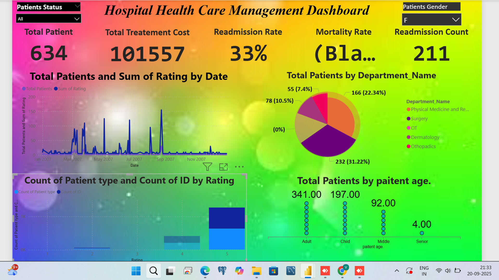

# 📊 Mock Dashboard

**Power BI project:** `For Mock Dashboard.pbix`

## 📖 Project overview

This repository contains a Power BI Desktop file (`For Mock Dashboard.pbix`) that demonstrates a mock dashboard built for learning, prototyping, and presentation purposes. The dashboard combines sample data, common BI patterns, and interactive visuals to showcase how to:

- 📥 Load and transform data  
- 🔗 Build a clean data model (tables, relationships)  
- ➕ Create calculated measures and columns using DAX  
- 🎨 Design interactive visualizations and report pages  
- 🎚️ Apply filters, slicers, and bookmarks for storytelling  

## 📂 Contents

- `For Mock Dashboard.pbix` — Power BI Desktop report file (primary artifact)  
- `README.md` — This document  

> 💡 **Note:** If sample data CSVs or other assets are included in the repository they will be listed here. If you don't see them, the `.pbix` contains embedded sample data.

## ✨ Key features

- 📑 Multi-page report with at least the following pages (names may vary):  
  - 🏠 Overview / Executive Summary  
  - 💰 Sales / Revenue analysis  
  - 📦 Product / Category breakdown  
  - 🗺️ Geographic map / Region analysis  
  - 📈 KPI tiles and trends  
  - 🔎 Drillthrough and detail pages  

- 📏 Reusable measures (Total Sales, YoY Growth, % of Total, Running Total)  
- 📅 Date table with proper relationships and time intelligence support  
- 🎛️ Slicers for time, region, and product selection  
- 📌 Bookmarks and page navigation for storytelling  

## 📸 Screenshots

Here are sample screenshots of the dashboard:

1.   
2.   
3.   
4.   
5.   

## 🔗 Data sources

The PBIX file may use one or more of the following:

- 📄 Embedded sample CSV / Excel data  
- 🗄️ DirectQuery or import from a database (if connected)  

If your copy of the PBIX expects external connections, open the file in Power BI Desktop and check **Transform data** > **Data source settings** to update connection credentials.

## 🖥️ How to open

1. 💻 Install Power BI Desktop (Windows) if you don't already have it: [Download here](https://powerbi.microsoft.com/).  
2. ⬇️ Download `For Mock Dashboard.pbix` from this repository.  
3. 🖱️ Double-click the `.pbix` file to open it in Power BI Desktop.  
4. 🔑 If any data source requires credentials, navigate to **Home > Transform data > Data source settings** to edit them.  

## 🛠️ How to use the report

- 🎚️ Use slicers at the top/side to filter the entire report.  
- 📊 Click on chart elements (bars, slices, map regions) to cross-filter other visuals.  
- 🗂️ Use bookmarks or navigation buttons to move between storytelling steps.  
- 🔍 Right-click rows in tables to drill through to detail pages (if configured).  

## 📝 Tips for editing

- 📅 Keep a single, well-documented Date table and mark it as a date table (Model view).  
- 🧮 Prefer measures over calculated columns for aggregations and time intelligence.  
- 🏷️ Use descriptive names for measures and tables (e.g., `Total Sales`, `Customer Count`).  
- 🧾 Document any transformation in the Power Query steps so other contributors can follow the ETL logic.  

## 🚀 Suggested improvements / next steps

- ⚙️ Add parameterized data source for easier environment switching (dev / prod).  
- 🔐 Implement row-level security (RLS) if sharing with multiple user roles.  
- 🏢 Separate large or sensitive data into a certified dataset (Power BI service) and connect via Live Connection.  
- 🗒️ Add tooltips and a documentation page listing each measure and its DAX formula.  

## 🤝 Contributing

If you want to contribute improvements to the dashboard:

1. 🍴 Fork the repository.  
2. ✏️ Make changes to a copy of the `.pbix` file and include a short changelog entry describing what you changed (new measures, new pages, data fixes).  
3. 📬 Create a pull request with your updates and screenshots of new/changed visuals.  

## 🛠️ Troubleshooting

- ❌ **File won't open**: Make sure you're using a recent Power BI Desktop version; older versions may not support newer features.  
- 📡 **Missing data / connections**: Check **Data source settings** and re-enter credentials if required.  
- 🐢 **Slow performance**: Consider reducing visuals on a page, importing data instead of DirectQuery, or optimizing the model (remove unused columns, create aggregations).  

## 📜 License

This project is provided under the MIT License unless otherwise specified. Update the LICENSE file if you require a different license.  

---
